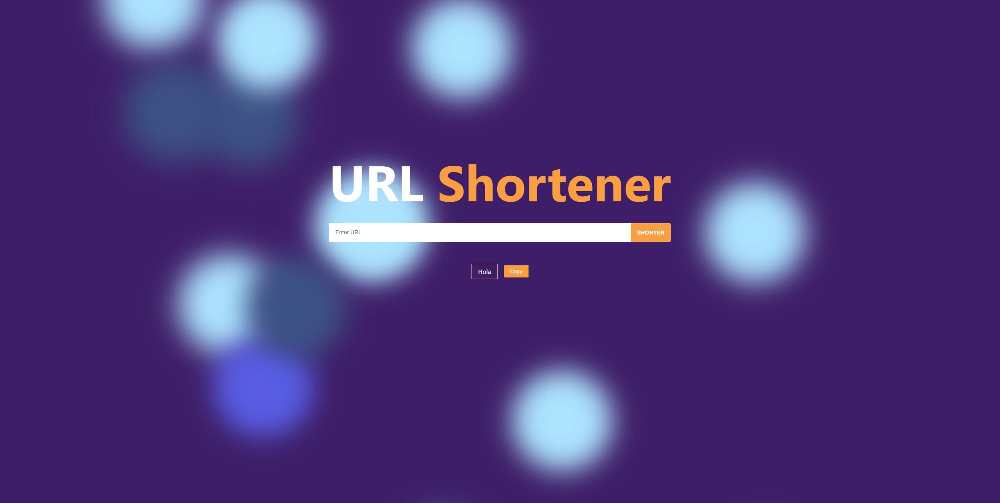

# URL Shortener - code component solution

This is a URL Shortener frontend solution with Reactjs using [Shrtco API](https://shrtco.de/docs) .

## Table of contents

- [Overview](#overview)
  - [Screenshot](#screenshot)
  - [Links](#links)
- [My process](#my-process)
  - [Built with](#built-with)
  - [Installation](#installation)
- [Author](#author)

## Overview

### Screenshot



### Links

- Solution URL: [https://github.com/darkmtrance/urlshortener-reactjs](https://github.com/darkmtrance/urlshortener-reactjs)
- Live Site URL: [https://url.matomaylla.com](https://url.matomaylla.com)

## My process

### Built with

- [ReactJS] (https://legacy.reactjs.org/) - Frontend
- [Axios] (https://axios-http.com/) - JavaScript library
- [react-copy-to-clipboard] (https://www.npmjs.com/package/react-copy-to-clipboard) - React component
- [Background-animated] (https://wweb.dev/resources/animated-css-background-generator) - Background css
- [Shortener-API] (https://shrtco.de/docs) - API

### Installation

```bash
git clone https://github.com/darkmtrance/urlshortener-reactjs.git
cd urlshortener-reactjs
npm install
```
run app

```bash
npm start
```


## Author

- Website - [Michael Tomaylla](https://cv.matomaylla.com/)
- Linkedin - [@matomaylla](https://www.linkedin.com/in/mtm2019/)
